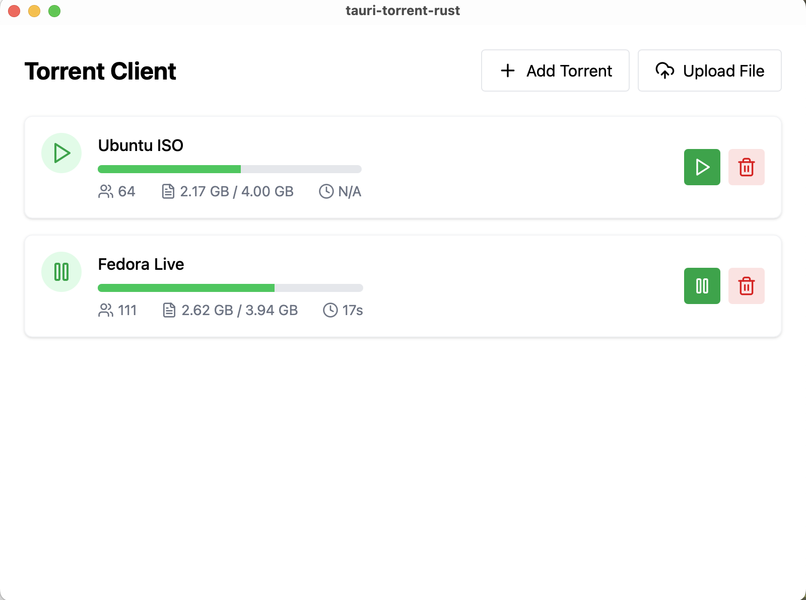

# Taurrent

A sleek, modern desktop BitTorrent client built with **Tauri**, **Rust**, and **Svelte**. Taurrent offers a clean UI for managing your torrents with features like adding via Magnet URI, uploading `.torrent` files, and simple pause/resume/delete controls.

---

## 📸 Screenshot



---

## 🚀 Features

- **Add Torrents**

  - Paste a Magnet URI or upload a local `.torrent` file

- **Manage Downloads**

  - Pause, resume, and remove torrents with a single click

- **Real-Time Stats**

  - View download progress, peer count, file sizes, and estimated time remaining

- **Lightweight & Fast**

  - Powered by a Rust-based torrent engine for high performance

---

## 🛠️ Installation & Setup

### Prerequisites

- **Node.js** (v16+)
- **Rust** (stable)
- **Tauri CLI**

  ```bash
  cargo install tauri-cli
  ```

### Clone & Install

```bash
# Clone the repo
git clone https://github.com/iamyxsh/tauri-torrent-rust.git Taurrent
cd Taurrent

# Install frontend dependencies
npm install
```

### Run in Development

```bash
npm run tauri dev
```

This will start the Tauri app in development mode with hot-reload for the Svelte UI.

### Build for Production

```bash
npm run tauri build
```

Your production binaries will be generated under `src-tauri/target/release`.

---

## 🧩 Project Structure

```
Taurrent/
├─ src/               # Svelte frontend source
│  ├─ components/     # UI components (TorrentList, AddTorrentModal, etc.)
│  └─ routes/         # SvelteKit pages and layouts
├─ src-tauri/         # Tauri Rust backend
│  ├─ main.rs         # Tauri setup and commands
│  └─ Cargo.toml      # Rust dependencies (cratetorrent, serde, ts-rs, etc.)
├─ README.md          # You are here
└─ screenshot.png     # App screenshot
```

---

## 🤝 Contributing

Contributions are welcome! Feel free to open issues or submit pull requests for bug fixes, new features, or improvements.

---

## 📄 License

This project is licensed under the MIT License.
